# Personal Radio

A private tool that learns your music taste from what you actually listen to on Spotify, then builds you a
weekly playlist of songs you have not heard yet.

It is made for one person (you). It runs on your own computer. Nothing is shared with anyone.

## What it does

1. **Watches your listening.** A small background program checks your Spotify account every few seconds and notes
   what you played, what you skipped, and what you let finish. It works for any device on your account, including
   your phone.
2. **Learns from it.** A song you finish counts as a "like". A song you skip in the first few seconds counts as a
   "no". Songs you saved to Liked Songs count as strong likes.
3. **Finds new music.** It looks up which songs people with similar taste play together (using free, public music
   databases, not Spotify's recommendations) and filters out remixes, live versions and very mainstream picks.
4. **Builds a playlist.** Once a week it creates a private Spotify playlist called
   **"Personal Radio - Weekly Auto"** with 30 songs. About half are close matches, some are songs by artists you
   already like that you have not heard, and the rest are experiments so the tool can keep learning.

## What you need

- A Windows or Mac computer that stays on (the watcher only sees what plays while it runs)
- Spotify **Premium** (Spotify requires it for the developer app this tool uses)
- Python 3.11 or newer (free, from python.org)
- About 30 minutes for the first setup

## Start here

| I want to... | Read |
|---|---|
| Set it up on my PC, step by step | [docs/GETTING_STARTED.md](docs/GETTING_STARTED.md) |
| Understand how it decides things | [docs/HOW_IT_WORKS.md](docs/HOW_IT_WORKS.md) |
| Know what is stored and how to erase it | [docs/PRIVACY.md](docs/PRIVACY.md) |
| Move everything from another computer, or read the full project history and research | [docs/MIGRATION_PACKAGE.md](docs/MIGRATION_PACKAGE.md) |
| Read the same migration package as a PDF (100 pages, with figures) | [docs/MIGRATION_PACKAGE.pdf](docs/MIGRATION_PACKAGE.pdf) |

## The ideas, illustrated

Each figure explains one idea. They are generated from the real program logic by `scripts/make_diagrams.py`, so
the numbers match what the code does.

### 1. The whole system

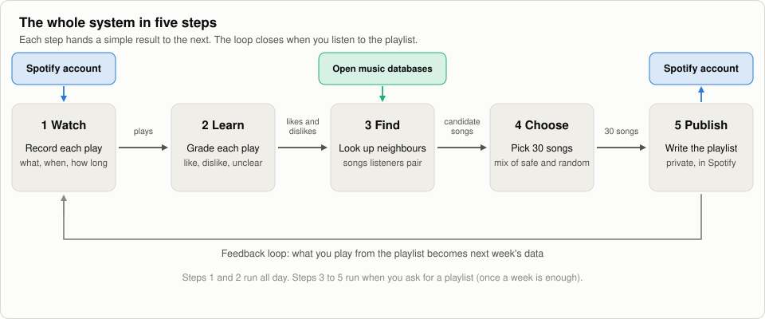

Five steps run in a loop. The program watches your Spotify plays, grades them, looks up similar songs in open
databases, picks 30, and writes a private playlist. What you play from that playlist becomes next week's data.

### 2. Watching without wasting effort

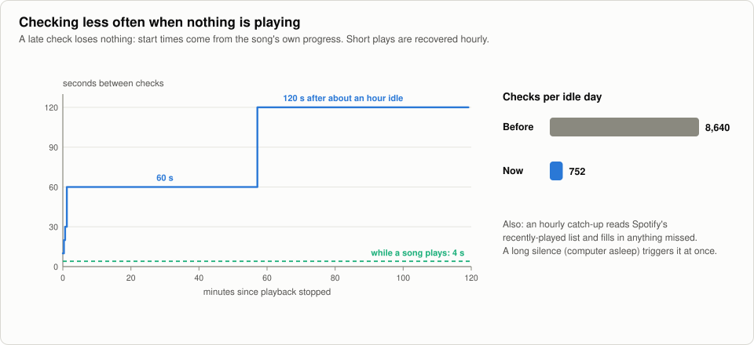

The program asks Spotify what is playing every 4 seconds while a song plays. When nothing plays it slows down to
once a minute, then once every 2 minutes. This cuts checks from about 8,600 to about 750 on an idle day. Nothing is
lost, because a song's start time is worked out from how far into it you were when the program noticed. Once an
hour, and right after a long silence such as the computer sleeping, it reads Spotify's "recently played" list to
fill any gaps.

### 3. From a play to a like or a dislike

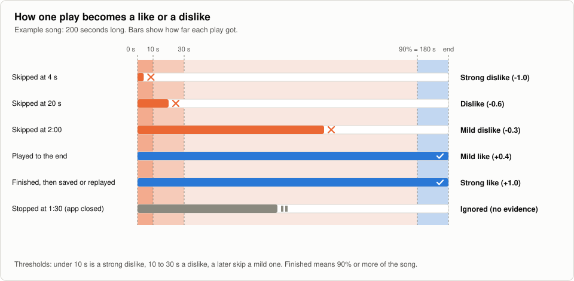

The program never asks you to rate anything. It reads behaviour. An early skip is a strong dislike, a late skip is
a mild one, and finishing is a like. Stopping because the app closed says nothing, so it is ignored. Saving or
replaying a song after you finish it makes the like strong.

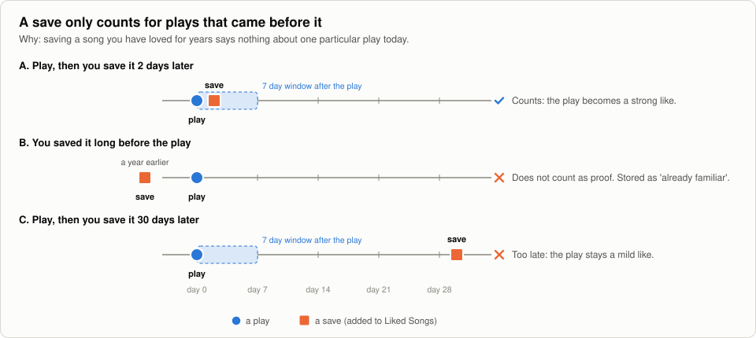

Timing matters. A save counts as proof only if it happens within 7 days after the play. A song saved a year ago
and played today tells the program you already knew the song, not that this play was good. Counting it would
inflate the scores of old favourites and make the program look better than it is.

### 4. How much each like counts

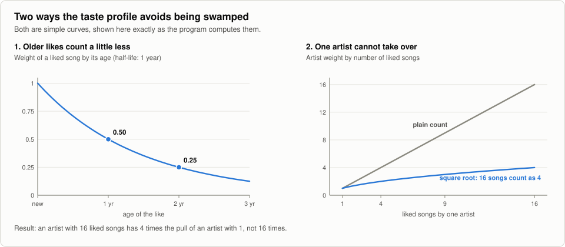

Two simple curves shape your taste profile. Older likes fade: a like loses half its weight each year. And an
artist's total pull grows with the square root of the number of liked songs, so 16 liked songs give 4 times the
pull of one, not 16 times. Without this, one heavily saved artist would decide the whole playlist.

### 5. Matching songs across services

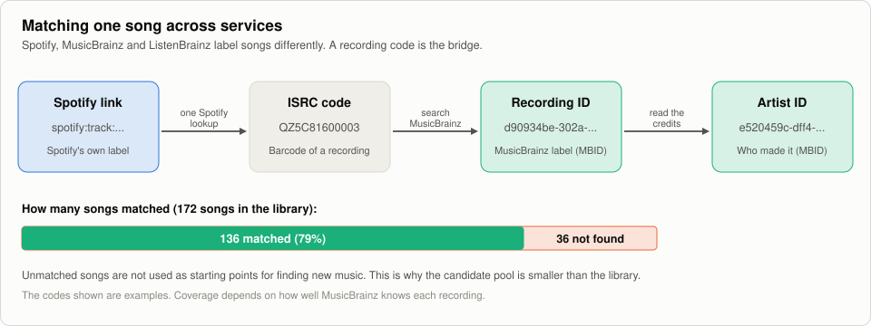

Spotify, MusicBrainz and ListenBrainz each name songs differently. A recording code (ISRC) is the shared key. The
program converts each Spotify song to an ISRC, then to MusicBrainz IDs. About 79% of the library matched. Unmatched
songs cannot be used as starting points.

### 6. Finding similar songs without Spotify

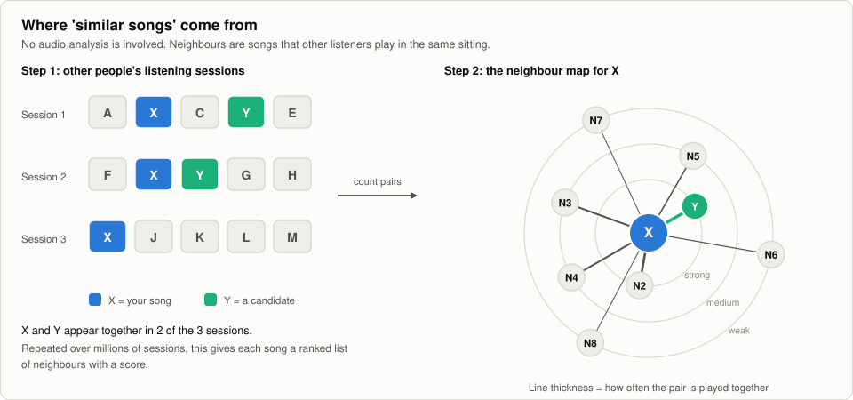

There is no audio analysis. ListenBrainz publishes which songs people play in the same listening session. If
song X and song Y keep showing up together, Y is a neighbour of X. The closer the ring in the map, the more often
the pair is played together.

### 7. Why famous songs do not dominate

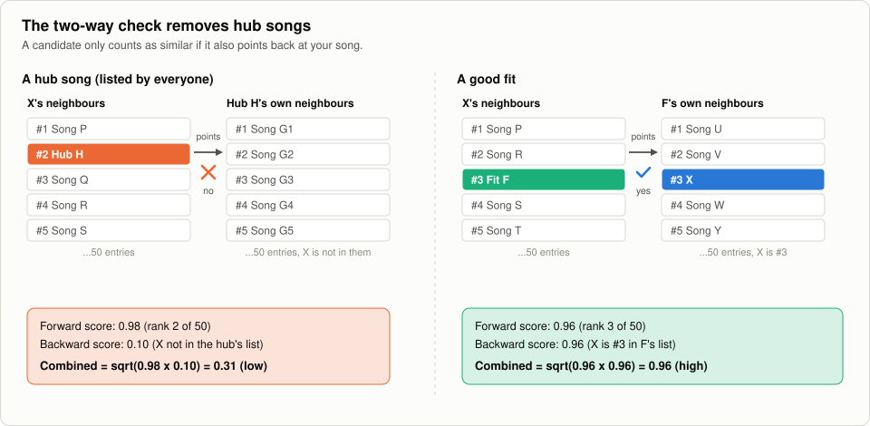

Some songs are neighbours of almost everything. These are hubs. A candidate is trusted only if it also points back:
your song X must appear in the candidate's own neighbour list. Hubs fail this check. Good fits pass.

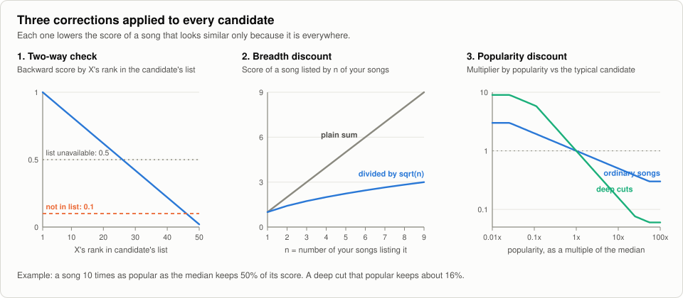

Three corrections adjust every score. The two-way check scales the score by how high your song ranks in the
candidate's list. The breadth discount stops a song from winning only because many seeds list it. The popularity
discount lowers the score of very well-known songs, and lowers it more for deep cuts so they are actually less
famous.

### 8. Choosing the 30 songs

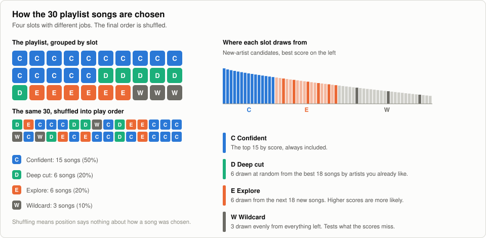

The playlist has four kinds of slots. Confident picks (15) are the best scores. Deep cuts (6) are songs you have not
heard by artists you already like. Explore picks (6) are drawn at random with better scores more likely. Wildcards (3)
are drawn evenly from the rest. The order is shuffled so position never reveals how a song was chosen.

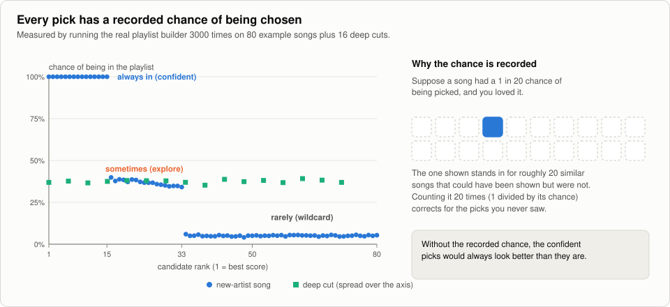

The program records how likely each song was to be chosen. This chart comes from running the real playlist builder
3,000 times. Confident songs are always in. Explore songs appear about a third of the time. Wildcards appear
rarely. Recording the chance allows a fair measurement later: a rare pick that you loved is counted as standing in
for about 20 similar songs that were never shown. Without it, safe picks would always look better than they are.

### 9. Checking honestly whether it works

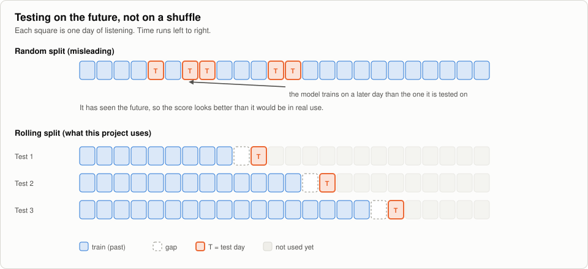

A random split trains on later days and tests on earlier ones. That leaks the future and flatters the result. The
program tests on the future only: train on the past, leave a short gap, test on the next day, then slide forward.

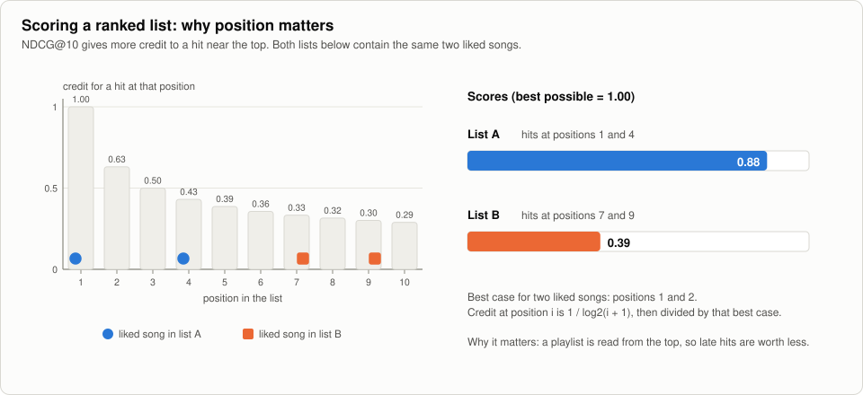

Scores use a measure called NDCG. It gives more credit to a liked song near the top of a list. Two lists with the
same two liked songs score 0.88 and 0.39 depending on where the hits sit. The recommender must beat simple
baselines, such as replaying recent favourites, before it is trusted.

### 10. What leaves your computer

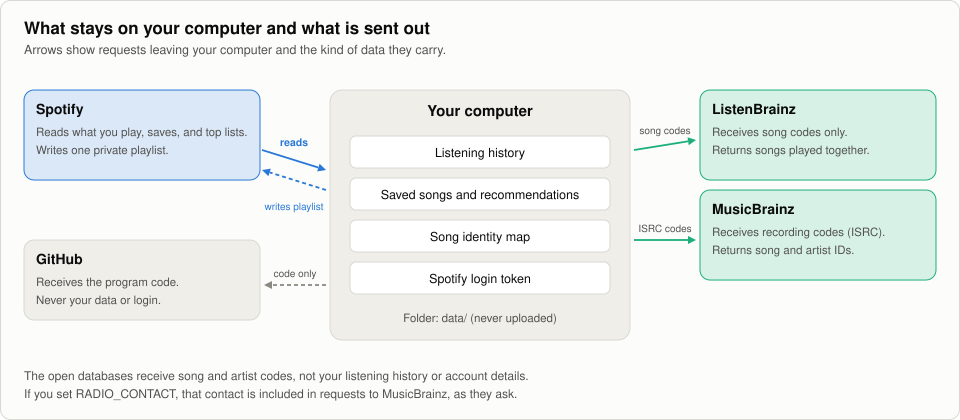

Your history, saves and Spotify login stay in the `data/` folder. The program sends requests to Spotify, to
ListenBrainz (song codes) and to MusicBrainz (recording codes). GitHub receives only the code. See
[docs/PRIVACY.md](docs/PRIVACY.md).

## The commands you will use

Type these in a terminal from the project folder. Replace `python` with `.venv\Scripts\python` on Windows or
`.venv/bin/python` on Mac if you set it up the way the guide shows.

| Command | What it does |
|---|---|
| `python -m radio track` | Starts watching your listening. Leave it running. |
| `python -m radio health` | Tells you whether the watcher is still alive. |
| `python -m radio identify` | Matches your songs to the public music databases. Run it before your first playlist. |
| `python -m radio playlist` | **Preview** this week's playlist. Nothing is changed in Spotify. |
| `python -m radio playlist --write` | Create or refresh the playlist in your Spotify account. |
| `python -m radio import-history FILE` | Load your downloaded Spotify "Extended Streaming History". |
| `python -m radio privacy` | See what is stored. Add `--purge` to delete old data, or `--disconnect --yes` to erase everything. |
| `python -m radio` | Lists all commands. |

## What is in this folder

```
radio/        the program (see below)
config/       your settings (which playlists count as "your taste")
data/         YOUR data: listening history, Spotify login, saved lookups. Created on first run. Never uploaded.
docs/         guides and the full project history
scripts/      a helper that makes the watcher start automatically on Windows
tests/        automatic checks that the program still works
```

Inside `radio/`:

| Folder | Job |
|---|---|
| `collect/` | Watches Spotify and saves what you played |
| `taste/` | Turns plays into likes and dislikes, and identifies songs |
| `recommend/` | Finds new songs and builds the playlist |
| `evalkit/` | Measures whether the recommendations beat simple guesses (needs a few weeks of data) |

## Honest status

| Part | State |
|---|---|
| Watching and saving your listening | Works. Runs best on a computer that is always on. |
| Weekly playlist | Works when you run it by hand. It does not yet run itself on a schedule. |
| Loading your Extended Streaming History | Written, but not yet tried on a real export (you must request it from Spotify first). |
| Measuring whether it is any good | Built, but needs several weeks of listening data before the numbers mean anything. |
| Fancier learning methods | Deliberately not built yet; the research says they need far more data than one person produces. |

Known quirk: the playlist this tool created has twice vanished from the Spotify account for reasons not yet
known. The tool notices and makes a new one, so if your playlist is replaced by a new copy, that is why.

## Rebuilding the figures and the PDF

```
python scripts/make_diagrams.py     # redraws docs/images/*.svg from the program's own logic
python scripts/make_pdf.py          # needs pandoc and Google Chrome installed
```

## Running the checks

```
python -m unittest discover -s tests -t .
```

A line ending in `OK` means everything passes. (Some warning lines about "musicbrainz lookup failed" are expected;
they come from a test that pretends the service is down.)
